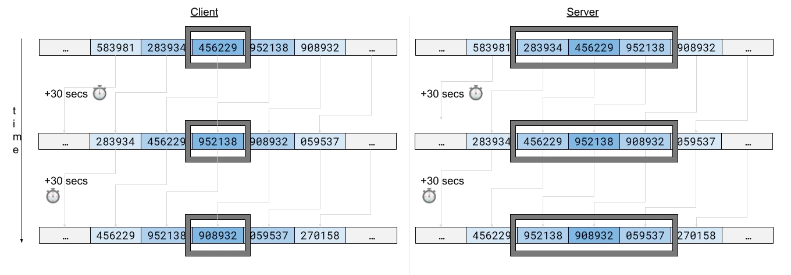
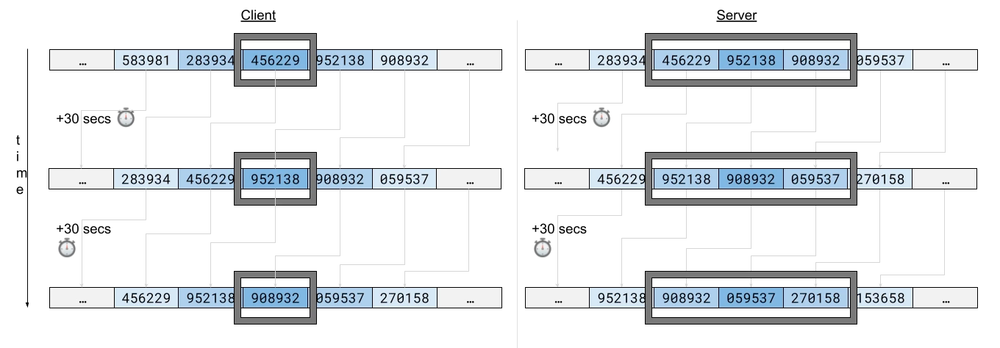

# 1time
[](LICENSE) [](CONTRIBUTING.md)

Java/Kotlin lightweight implementation of RFC-6238 and RFC-4226 to generate and validate time-based one-time passwords (TOTP).

## Maven / gradle dependency

Check the latest package at [https://github.com/atlassian-labs/1time/packages/](https://github.com/atlassian-labs/1time/packages/)

## Quick start

This library is suitable for both prover and verifier. 

### Prover

As described in RFC-6238, the prover is the user trying to authenticate and submitting the generated TOTP to the verifier.

An example is: The user is trying to access an online service and is required to input the TOTP after authenticating with username and password. 
The user will need an application to generate such TOTP.

To generate the current TOTP for a given user's secret, do:

Assuming the user's enrollment has a base 32 encoded secret key: `ZIQL3WHUAGCS5FQQDKP74HZCFT56TJHR`

We can then generate the TOTP for the current time step:

```kotlin
val secret = TOTPSecret.fromBase32EncodedString("ZIQL3WHUAGCS5FQQDKP74HZCFT56TJHR")
val totpGenerator: TOTPGenerator = TOTPGenerator()
val totp = totpGenerator.generateCurrent(secret) //TOTP(value=123456)
```
You can now present the value of `totp` to the user.

### Verifier

As described in RFC-6238, the verifier is the system validating the user's credentials, including multi-factor authentication. After the system validates the username/password, it then verifies the user's TOTP input.

But before being able to verify a user's TOTP, we need to enrol the user.

Upon an enrolment request, the system will
- Generate a secret and store it for the user and other information the system deems necessary.
- Generate a TOTP URI for further QR code generation that will allow the user to enrol with mobile apps such as Google Authenticator

This library generates secrets and TOTP URIs.

#### Generating a secret

```kotlin
val service = DefaultTOTPService()
val secret = service.generateTotpSecret()
secret.base32Encoded //NIQXUILREVGHIUKNORKHSJDHKMWS6UTY
```
#### Generating a TOTP URI

```kotlin

val totpUri = service.generateTOTPUrl(
    secret, ////NIQXUILREVGHIUKNORKHSJDHKMWS6UTY
    EmailAddress("jsmith@acme.com"),
    Issuer("Acme Co")
)
totpUri // otpauth://totp/Acme+Co:jsmith%40acme.com?secret=NIQXUILREVGHIUKNORKHSJDHKMWS6UTY&issuer=Acme+Co&algorithm=SHA1&digits=6&period=30
```

Once generated the totpUrl, the system can use any library of choice to generate the TOTP QR code. For example:


#### Verifying enrolled user

After the user has successfully enrolled, both the user and the system will share the secret.

When the user (prover) is trying to authenticate, the system (verifier) will validate the user's TOTP input.

In order to do so, do:

```kotlin
val userInput: TOTP = TOTP("123456") //TOTP from user input
val result = service.verify(
  userInput, 
  secret //NIQXUILREVGHIUKNORKHSJDHKMWS6UTY
)
```

The obtained `result` can be either
- `TOTPVerificationResult.InvalidOtp`: The provided TOTP is invalid for the secret and default configuration
- `TOTPVerificationResult.Success`: The provided TOTP is valid for the secret and default configuration. In addition, the index of the matching TOTP is provided in the `Success` data class.

#### Success - index of matching TOTP

When the verification is successful, the type of `result` will be `TOTPVerificationResult.Success`. This data class contains an index value:

```kotlin
data class Success(val index: Int) : TOTPVerificationResult()
```

The index value indicates the window on which the TOTP was found. More on windows [here](#prover-clock-delays-and-verifier-allowed-windows).

When the verifier allows, for instance, 1 past window, one present window (mandatory) and one future window, upon successful verification, the index value will be:
- -1 when successful on past window or T - 1
- 0 when successful on current window
- 1 when successful on future window

This index is useful if your solution wants to implement [resynchronization](https://datatracker.ietf.org/doc/html/rfc6238#section-6).

From RFC-6238:
> Upon successful validation, the
validation server can record the detected clock drift for the token
in terms of the number of time steps.  When a new OTP is received
after this step, the validator can validate the OTP with the current
timestamp adjusted with the recorded number of time-step clock drifts
for the token.

By keeping track of the successful indexes per user device, the verifier could adjust the allowed windows to cater for prover's clock drifts. 

### Tuning configuration

The previous instructions rely on a set of defaults.

#### Default values for TOTP Generator

TOTP Generator constructor takes the following parameters and corresponding default values:

```kotlin
val totpGenerator: TOTPGenerator = TOTPGenerator(
  clock = Clock.systemUTC(),
  startTime = 0,
  timeStepSeconds = 30,
  otpLength = OTPLength.SIX,
  digest = HMACDigest.SHA1
)
```

- `startTime`: Epoch second from which the counter starts. By default is 0, which points to Thursday, January 1, 1970 0:00:00 GMT.
- `timeStepSeconds`: The duration of a TOTP. By default, is 30 seconds.
- `otpLength`: TOTP digit count. By default, is 6 digits.
- `digest`: HMAC algorithm. By default, is SHA1.

:warning:  We recommend **not to change** these default values since apps such as Google Authenticator will **ignore** the custom values provided in the totp url and default to the agreed standards. 

See Google Authenticator handling of these parameters: 
[Key-Uri-Format](https://github.com/google/google-authenticator/wiki/Key-Uri-Format)

#### Default values TOTP service

These defaults apply for the verifier.

TOTP Service constructor takes the following parameters and corresponding default values:

```kotlin
val service = DefaultTOTPService(
  totpGenerator = TOTPGenerator(),
  totpConfiguration = TOTPConfiguration()
)
```
- `totpGenerator`: The default generator as described before. You could create different instances of `DefaultTOTPService` with different configurations of `totpGenerator`. This may be useful if your solution stores detailed configuration such as TOTP length, time step size and hashing algorithm per enrolment instead of a global configuration. If enrolment will allow the user to choose these parameters, then make sure the prover app supports such configuration.
- `totpConfiguration`: This configuration allows to tune how the verification behaves in terms of accepted windows and how to generate secret keys.
  - `secretProvider`: By default we provide `AsciiRangeSecretProvider`. This is a random key generator that generates 20 bytes in the ASCII range. This is useful for when you need the raw secret value to be composed of printable characters. You can provide your own Secret provider by extending `SecretProvider` functional interface.
  - `allowedPastSteps`: By default, this is 0. As specified by [RFC-6238](https://datatracker.ietf.org/doc/html/rfc6238#section-5.2), the verifier should accept the TOTP from the previous time step to cater for possible network delays. If you want to accept past windows as valid, increase this number. 
  - `allowedFutureSteps`: By default, this is 0. Same as `allowedPastSteps` but to cater for possible clock drifts in which the prover's clock is slightly in the future relative to the verifier's. If you want to accept future time windows as valid, increase this number. More on time windows on the [next section](#prover-clock-delays-and-verifier-allowed-windows).

## Secret providers

We include two secret providers

- `AsciiRangeSecretProvider`: Will generate 20 random bytes in the ASCII range. This enables the raw value to be printable and easier for transport / debugging.
- `RandomSecretProvider`: Will generate 20 random bytes in the entire byte range. 

If you want to use better random generators such as AWS KMS, you can implement your own `SecretProvider` and use such provider in the `totpConfiguration` of the `DefaultTOTPService`.

## Prover clock delays and verifier allowed windows

When both the prover's and verifier's clocks are in sync, this is what it would look like when the verifier allows one past window and 1 future window:



The current TOTP for the prover is what the server sees in the middle of the window, since it now accepts TOTPs from 3 time windows; current window, the previous and the next.

But when the prover's clock is delayed relative to the verifiers, this is what it would look like:



When the verifier generates the list of 3 TOTPs for the user, the one the prover provided is already in the past. 

This can also happen due to network delay. Say the prover submitted the TOTP close to the end of the time window of 30 seconds and given network delays, upon calculation on the verifier, that TOTP value is no longer the current, but the previous. In these cases it makes sense to deem that TOTP as valid to prevent the prover from having to resubmit the TOTP.

Similarly to the prover's clock being delayed, it can also happen that it is slightly in the future relative to verifier's clock. The opposite to the diagram above would happen and upon calculation on verifier's side, the TOTP provided will be the next to current. It also makes sense to deem that attempt as valid.

## Contributions

Contributions to 1time are welcome! Please see [CONTRIBUTING.md](CONTRIBUTING.md) for details.

## License

Copyright (c) 2022 Atlassian and others.
Apache 2.0 licensed, see [LICENSE](LICENSE) file.

<br/> 


[](https://www.atlassian.com)
